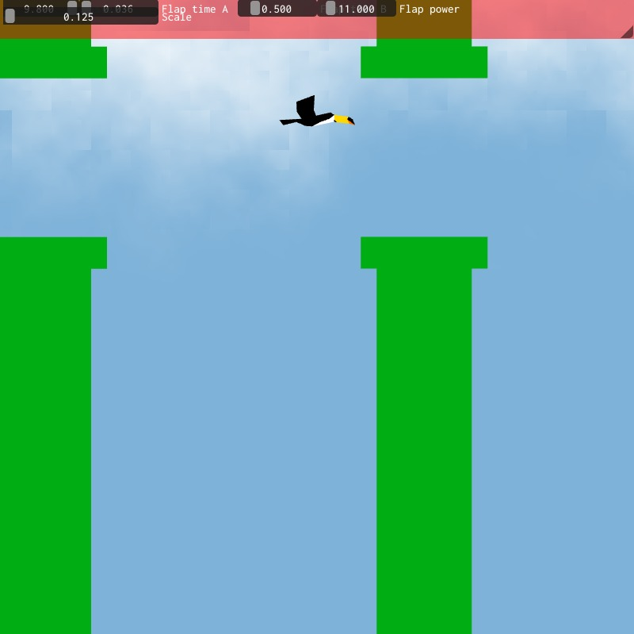

<div>
<h1>UfabcBirds - Relatório do Projeto</h1>

</div>

**Disciplina**: Computação Gráfica  
**Professor**: Celso Setsuo Kurashima  
**Período**: 2024.3  

## Desenvolvedores
- Leonardo Pires de Oliveira - 11201920744
- Leopoldo Kenji Sugata Naves - 11201722022

## Descrição do Projeto
Este projeto foi desenvolvido como parte das atividades práticas da disciplina de Computação Gráfica. O objetivo é criar uma versão personalizada do jogo Flappy Bird, com diversificação de espécies, e tendo como protagonista a fauna brasileira, utilizando a biblioteca ABCg e OpenGL para renderização gráfica.

O jogo apresenta algumas diferenças em relação ao Flappy Bird clássico, como:
- Diversificação de espécies, com personagens inspirados em aves brasileiras.
- Obstáculos personalizados, incluindo variações que representam desafios adicionais para o jogador.

O jogo foi implementado em C++ e segue uma estrutura modular para facilitar a expansão de funcionalidades e mecânicas de jogo.

## Estados do Jogo
O projeto utiliza a estrutura `gameData` para gerenciar os estados principais e a interação do jogo:
- **Playing**: Indica quando o jogo está em execução, com o jogador controlando o pássaro e interagindo com os obstáculos.
- **GameOver**: Estado que ocorre quando o pássaro colide com um obstáculo ou com os limites da tela, finalizando a rodada.
- **Interação "Up"**: O estado "up" também é gerenciado dentro de `gameData`, permitindo ao jogador realizar o impulso para cima ao pressionar uma tecla ou botão específico. Essa ação é essencial para controlar a altura do personagem e evitar colisões.

Esses estados permitem uma transição organizada entre o início e o fim do jogo, além de facilitar o controle da lógica de reinicialização e feedback para o jogador.

## Mecânica de Interação
A principal interação do jogador no UfabcBirds é a ação de "ir para cima" (ou "up"), gerenciada pelo `gameData`. Ao pressionar uma tecla ou botão específico, o personagem (pássaro) realiza um impulso para cima, ajudando-o a desviar dos obstáculos e a manter-se dentro do cenário. Essa interação é essencial para a jogabilidade, permitindo ao jogador controlar a altura do personagem e evitar colisões.

## Mecânica de Colisão
O sistema de colisão foi implementado para detectar o contato entre o pássaro e os obstáculos, assim como entre o pássaro e os limites do cenário. Esse recurso é fundamental para a jogabilidade, garantindo que o jogo termine adequadamente ao detectar uma colisão. A lógica de colisão está localizada na classe `Window`, e uma versão mais completa do sistema de colisão está sendo trabalhada em outra branch do repositório para ajustes adicionais.

## Estrutura do Projeto
O projeto está organizado da seguinte maneira:

- `CMakeLists.txt`: Script de configuração para o CMake, que compila o projeto.
- `README.md`: Documentação inicial do projeto.
- `main.cpp`: Contém a função principal do jogo, que inicializa a janela e as configurações básicas do OpenGL.
- `window.hpp` e `window.cpp`: Declaram e implementam a classe `Window`, responsável por controlar o loop de jogo, renderização dos objetos, lógica de colisão, interação com o usuário e controle da ação de "ir para cima".
- `bird.cpp` e `bird.hpp`: Contêm a lógica e os atributos do personagem principal (pássaro) do jogo.
- `bg.cpp` e `bg.hpp`: Gerenciam o fundo e seu comportamento.
- `pipe.cpp` e `pipe.hpp`: Controlam os obstáculos do jogo.
- `tucano.cpp`: Implementa o personagem tucano, com animações e layout específicos.
- `gamedata.hpp`: Define a estrutura `gameData`, incluindo os estados `playing`, `gameOver` e a interação `up` para o controle do fluxo do jogo e das ações do jogador.
- `assets/`: Contém os arquivos de sombreamento utilizados na renderização gráfica do jogo:
  - `bg.frag` e `bg.vert`: Shaders para o fundo.
  - `bird.frag` e `bird.vert`: Shaders para o pássaro.
  - `pipe.frag` e `pipe.vert`: Shaders para os obstáculos.

## Tecnologias Utilizadas
- **Linguagem**: C++
- **Biblioteca Gráfica**: OpenGL
- **Biblioteca de Suporte**: ABCg (biblioteca fornecida pelo professor)
- **Plataforma de Desenvolvimento**: Linux
- **IDE**: Visual Studio

## Como Executar o Projeto
Clone este repositório no seu ambiente local:
```bash
git clone [[URL do repositório]](https://github.com/LeonOliveir4/UfabcBirds_2D/tree/CenarioInicial_FlappyBird)
```
build:
```bash
./build.sh (linux); build.bat (windows)
```
[[URL do geogebra]](https://www.geogebra.org/m/grqgfqfh)
