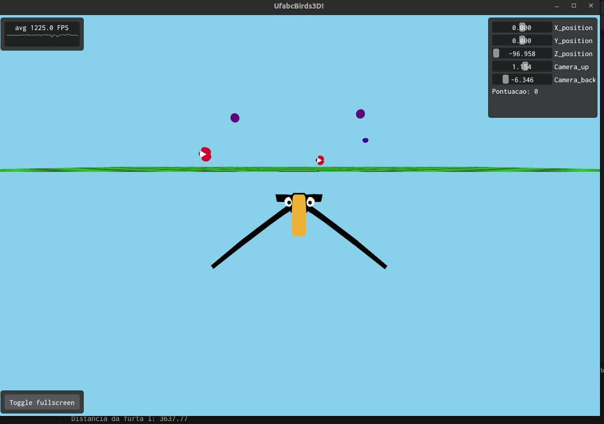

<div>
<h1>(11) UfabcBirds 3D -- (19.12.2024)</h1>

</div>

## Disciplina
**Computação Gráfica**  
**Professor**: Celso Setsuo Kurashima  
**Período**: 2024.3  

---

## Desenvolvedores
- Leonardo Pires de Oliveira - 11201920744  
- Leopoldo Kenji Sugata Naves - 11201722022  

---

## Guia de utilização

### Como Executar o Projeto
1. Clone este repositório:
   ```bash
   git clone https://github.com/LeonOliveir4/UfabcBirds_3D.git
	```
	
2. Rodar o código:
   ```bash
   ./build.sh (Linux) ou build.bat (Windows)
	```
	
3. Executar o jogo:
   ```bash
   ./build/bin/ufabcbird3d/ufabcbird3d
	```
### Controles

#### Durante o jogo:
- **Movimento**:
  - **Pitch (Inclinação para cima e para baixo)**:
    - `↑` ou `W`: Inclinar para cima.
    - `↓` ou `S`: Inclinar para baixo.
  - **Yaw (Girar para esquerda e direita)**:
    - `←` ou `A`: Girar para a esquerda.
    - `→` ou `D`: Girar para a direita.
  - **Roll (Rotação em torno do eixo frontal)**:
    - `Q`: Rotacionar para a esquerda.
    - `E`: Rotacionar para a direita.

#### Quando o jogo estiver na tela de Game Over:
- Pressione `Espaço` para reiniciar o jogo.

## Introdução

O Projecto UfabcBirds 3D foi desenvolvido como parte da disciplina de Computação Gráfica, onde se procura juntar aspectos técnicos da renderização 3D com a consciência ambiental principalmente para crianças. Se inspirando no bioma brasileiro, você pode ser um tucano ou (futuramente) um papagaio, com o cenário 3D onde você busca por frutas represetantes da flora brasileira.

Proporcionando um ambiente imersivo, e utilizando libs conhecidas  e técnicas de computação gráfica como transformações geométricas, animações e controle de câmera, proporcionando bastante conhecimento. Com uma abordagem lúdica, o projeto estimula o aprendizado e desperta o interesse pela preservação ambiental, apresentando de forma didática informações sobre as aves e suas características.

A estrutura do jogo foi concebida para explorar conceitos avançados de gráficos computacionais, incluindo shaders, texturização e manipulação de estados do jogo. Assim, o UfabcBirds 3D é tanto uma ferramenta de aprendizado técnico quanto uma experiência interativa voltada para a educação e conscientização.

## Descrição do Projeto
O **UfabcBirds3D** é um projeto desenvolvido como parte da disciplina de Computação Gráfica, que implementa uma aplicação com gráficos 3D utilizando **OpenGL** e a biblioteca **ABCg**. O projeto inclui transformações geométricas para manipulação e animação de objetos 3D, bem como a gestão de estados do jogo, como `gameOver` e `playing`.

Além do aspecto técnico, o projeto tem um caráter educativo, destacando a fauna e a flora brasileiras. Os jogadores poderão controlar espécies de pássaros brasileiros, como o tucano, e interagir com frutas características da flora nacional, promovendo conscientização ambiental e cultural.

### Objetivos do Projeto:
1. **Renderização de gráficos 3D**: Criação de modelos tridimensionais e renderização no espaço 3D.
2. **Transformações geométricas**: Implementação de translações, rotações e escalas nos objetos.
3. **Animações**: Manipulação contínua de objetos e câmera para criar uma experiência dinâmica.
4. **Jogabilidade**:
   - Controle de pássaros 3D que coletam frutas espalhadas pelo cenário.
   - Disponibilidade de pelo menos **duas espécies jogáveis de pássaros brasileiros**.
   - Inclusão futura de frutas representativas da flora brasileira.
5. **Estados do jogo**: Inclusão de `gameOver` e `playing`, controlando o fluxo da aplicação.
6. **Educação**: 
   - Promover conhecimento sobre a biodiversidade brasileira, com destaque inicial para o **tucano**.
   - Criar uma experiência interativa que incentive o aprendizado sobre espécies de aves e frutas brasileiras.

---

## Funcionalidades
- **Gráficos 3D**: Representação visual de modelos tridimensionais, como aves brasileiras.
- **Transformações geométricas**:
  - Controle de posição (translação), escala e rotação dos objetos em tempo real.
  - Movimentação da câmera no ambiente tridimensional.
- **Animação**: Alteração contínua das propriedades dos objetos para criar movimento.
- **Jogabilidade**:
  - Controle de pássaros com teclas de movimentação e rotação (`W`, `A`, `S`, `D`, `Q`, `E`).
  - Gerenciamento de colisões, incluindo limites do cenário e colisões com o solo.
  - Exibição de estado `gameOver` e reinício com tecla `ESPAÇO`.
  - Textos explicativos com informações sobre as aves.
- **Estados do jogo**:
  - **`playing`**: Estado principal, onde o jogador interage com o ambiente 3D.
  - **`gameOver`**: Estado de término, ativado ao alcançar uma condição específica no jogo (ex.: limite do terreno ou colisão com o solo).
- **Educação**:
  - Informações sobre as aves aparecem como um popup no jogo, promovendo conhecimento.
  - Representação inicial do **tucano**, com planos para expandir para outras espécies, como o papagaio.

---

## Estrutura do Projeto
### Arquivos principais:
- **Código-Fonte**:
  - `animation.cpp` e `animation.hpp`: Controlam animações específicas de elementos no jogo.
  - `bird.cpp` e `bird.hpp`: Implementação dos pássaros jogáveis, incluindo reset, movimentação e lógica de colisão.
  - `camera.cpp` e `camera.hpp`: Classe responsável pela projeção e movimentação da câmera.
  - `gamedata.cpp` e `gamedata.hpp`: Gerenciamento de estados e dados do jogo.
  - `window.cpp` e `window.hpp`: Controle do ciclo de vida da aplicação, eventos do usuário, lógica de renderização e gerenciamento de estados.
  - `modelObj.cpp` e `modelObj.hpp`: Carregamento e manipulação de modelos OBJ.
  - `ground.cpp` e `ground.hpp`: Gerenciamento do cenário do chão.
  - `texture.hpp` e `light.hpp`: Gerenciamento de textura e iluminação do jogo.
  - `main.cpp`: Entrada principal do programa.

- **Assets**:
  - **Modelos para cada pássaro**:
    - `asa_direita.obj`, `asa_direita.mtl`: Modelo e material da asa direita.
    - `asa_esquerda.obj`, `asa_esquerda.mtl`: Modelo e material da asa esquerda.
    - `bico.obj`: Modelo do bico.
    - `corpo.obj`, `corpo.mtl`: Modelo e material do corpo.
    - `rabo.obj`: Modelo do rabo.
  - **Shaders**:
    - `model.vert`: Vertex shader para renderização de objetos.
    - `model.frag`: Fragment shader para renderização de objetos.

---

## Ultimas atualizações
- Implementação de popups educativos:
  - Exibição de mensagens informativas no início do jogo, relacionadas ao pássaro selecionado.
  - Textos são exibidos gradualmente, com a opção de alterar a velocidade de exibição.
- Correções de colisões:
  - A lógica foi aprimorada para detectar corretamente colisões laterais e frontais dos pássaros com o chão.
- Movimentação e câmera:
  - A câmera foi ajustada para seguir suavemente o pássaro.
  - Limites do terreno foram corrigidos para refletir o tamanho real do cenário.
- Novo sistema de reset:
  - Reseta o estado e posicionamento dos pássaros corretamente após o estado `gameOver`.
- Incluindo texturas e iluminação.

---

## Conclusão
O projeto UFABC Bird 3D mostra como é possível integrar técnicas de computação gráfica ao sistema educacional infatil, para temas onde o aprendizado lúdico poderia facilitar o engajamento das crianças, como nesse caso onde o tema é meio ambiente e muitas vezes passa despercebido. O jogo destaca conceitos avançados como transformações geométricas e animações, mas traz como seu ponto forte a facilidade de demonstrar a biodiversidade da fauna e da flora brasileira.

O jogo oferece, por meio de uma interface intuitiva e interativa, a oportunidade de explorar a beleza e singularidade das aves brasileiras e interagir com frutas pertencentes a fauna isso em um jogo de mundo aberto, com bastante espaço para interação. Este projeto representa não apenas um marco no aprendizado dos desenvolvedores envolvidos, mas também uma plataforma que pode ser expandida para incluir mais elementos da rica fauna e flora brasileiras.

Futuras melhorias podem incluir a adição de novas espécies jogáveis, cenários diversificados e funcionalidades mais avançadas, como inteligência artificial para interações dinâmicas. Com isso, o UfabcBirds 3D pode continuar a evoluir como um projeto que une inovação tecnológica com conscientização ambiental, inspirando tanto jogadores quanto futuros desenvolvedores.


## Referências:
- CUNNINGHAM, S. Graphics Shaders: Theory and Practice. Boca Raton: CRC Press, 2009.
- KESSENICH, J. M.; SELLERS, G.; SHREINER, D. OpenGL Programming Guide: The Official Guide to Learning OpenGL, Version 4.5 with SPIR-V. 9. ed. Reading: Addison-Wesley Professional, 2016.
- QUÍLEZ, Í. Íñigo Quílez. Disponível em: https://www.iquilezles.org/. Acesso em: 17 dez. 2024.
- BATAGELLO, H. ABCg: Aula Básica de Computação Gráfica. Disponível em: https://hbatagelo.github.io/cg/abcg.html. Acesso em: 17 dez. 2024.
- THOMPSON, J. Collision Detection. Disponível em: https://www.jeffreythompson.org/collision-detection/. Acesso em: 18 dez. 2024.